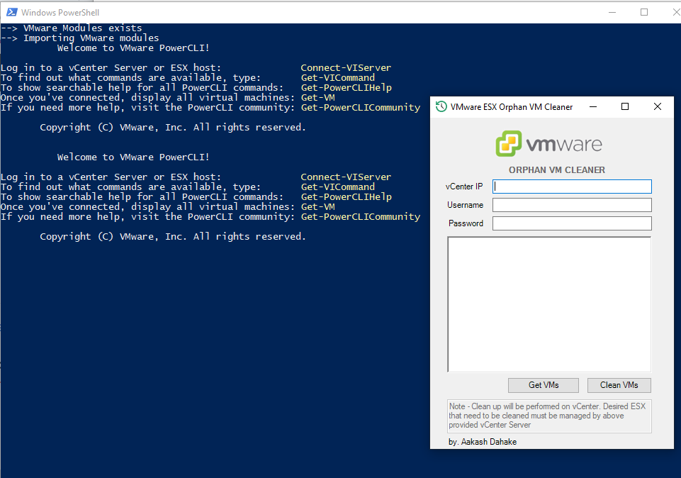

# Orphan-VM-Cleaner

This tool is used to clean ESX server for Orphan entries of deleted VMs.

Download OVMC.ps1 and run it with Administrator privileges.

It requires VMware PowerCLI module, it downloads if module is not available from Powershell Gallery

Screenshot-

